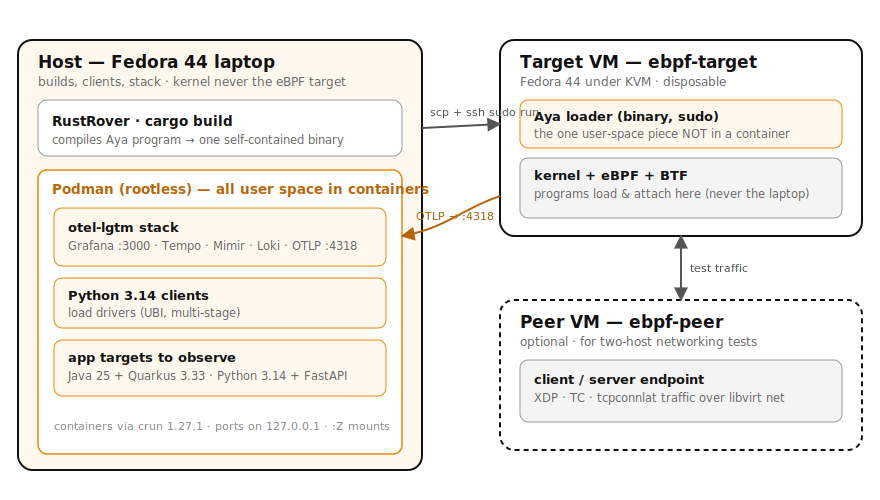

# eBPF with Aya on Fedora

A hands-on, chapter-based tutorial for writing **eBPF programs in Rust
with [Aya](https://aya-rs.dev/)**, deploying them safely to a **Fedora 44
KVM virtual machine**, driving load from **Python 3.14** clients in
Podman, and visualizing the output in **Grafana** (Tempo, Prometheus, Loki —
Mimir in production) via **OpenTelemetry**.

The published tutorial lives at:
**<https://patterncatalyst.github.io/ebpf-with-aya/>**

> This is **not** a Rust tutorial — it assumes you've read *The Rust
> Programming Language*. It is an eBPF/Aya tutorial that happens to be
> wired into a real lab and a real observability stack from chapter one.

---

## What this tutorial teaches

By the end of the **Foundations** part (Chapters 0–6) you will:

- Provision a disposable Fedora 44 eBPF **target VM** under KVM/libvirt
  from a single script (plus an optional second VM and the network
  between them for two-host tests).
- Stand up the **Grafana / Tempo / Prometheus / Loki** observability
  stack (the `otel-lgtm` image; Mimir is the production swap for Prometheus)
  in one Podman container and report into it via OpenTelemetry.
- Install the **Rust 1.96.0 + Aya** toolchain (rustup, the BPF target,
  `bpf-linker`, `cargo-generate` + `aya-template`, RustRover).
- Understand eBPF **concepts** — programs, maps, the verifier, BTF/CO-RE
  — and build, deploy, and observe a **first Aya program**.

Every later chapter is a new program type (`opensnoop`, `execsnoop`,
`tcpconnlat`, XDP load balancer, `scx_nest`, `sslsniff`, `struct_ops`,
and the rest), built on the same loop. See the
[roadmap](./_plans/iteration-plan.md).

## The lab model



A Fedora 44 **laptop** builds the Aya binaries, runs the Python 3.14 load
drivers and the `grafana/otel-lgtm` stack (all in Podman), and `scp`s each
binary to the **`ebpf-target`** guest VM, where it loads and attaches — eBPF
runs in the guest kernel, never the laptop's. The guest reports back over
**OTLP** to Grafana (`:3000`). An optional **`ebpf-peer`** VM provides a second
host for the two-host networking chapters.

## Quick start

```bash
# 1. read the prerequisites and provision the lab
#    (full instructions on the site: /docs/01-prerequisites/ and /docs/02-lab-setup/)
cd scripts/lab && ./provision-vm.sh ebpf-target

# 2. bring up the observability stack
cd examples/03-observability-stack && ./demo.sh

# 3. install the toolchain (see /docs/04-rust-aya-toolchain/), then build + deploy hello-world
cd examples/06-hello-world && ./demo.sh
```

## Project layout

```
.
├── _config.yml                 ← Jekyll site config
├── _docs/                      ← Tutorial chapters (00-outline.md … NN-*.md)
├── _includes/  _layouts/       ← HTML wrappers
├── _parts/                    ← One file per Part; drives the homepage Part cards + /parts/ pages
├── _plans/
│   ├── iteration-plan.md       ← Roadmap: every topic mapped to an iteration
│   ├── reconciliation-plan.md  ← Audit trail: verified vs. unverified
│   └── prd-reconciliation.md   ← What shipped vs. planned (filled at close)
├── assets/css/site.css         ← Hand-rolled styles (Red Hat fonts, eBPF amber)
├── assets/diagrams/            ← Paired .svg + .excalidraw (later iterations)
├── examples/                   ← Runnable Aya projects + demo.sh per chapter
│   ├── 03-observability-stack/ ← otel-lgtm stack + Python 3.14 client
│   └── 06-hello-world/         ← first Aya program (workspace + deploy)
├── onboarding/                 ← Repo orientation for contributors
│   ├── README.md  GETTING-STARTED.md  LESSONS-LEARNED.md  STARTING-WITH-CLAUDE.md
├── scripts/
│   ├── lab/                    ← VM provision/destroy/deploy + cloud-init
│   ├── lib/_helpers.sh
│   └── test-all-examples.sh
├── CONTRIBUTING.md             ← Conventions + the source/tooling provenance policies
└── PRD.md                      ← What we're building and why
```

## Conventions (the short list)

- **Podman**, not Docker. **`127.0.0.1`**, not `localhost`. **`:Z`** on
  bind mounts. **UBI** images, fully qualified.
- eBPF runs in the **guest VM**, never the host kernel.
- Kernel tooling (`bpftool`, `bpftrace`, `bcc`, `perf`) comes from
  **Fedora/Red Hat repos** only.
- Multi-step procedures ship as **scripts in the tarball**; pasted
  commands are **single-line** (zsh-paste-safe).
- Iterations ship as **`ebpf-with-aya-rNN.x.tar.gz`**, extracted in
  place.
- Claims are **`unverified`** until run on Fedora 44.
- **No copied/ported code** — insight from anywhere, but what we ship
  is original and clearly licensed. See `CONTRIBUTING.md`.

## Status

The technical body is **complete: Chapters 0–66**, across eleven parts —
Foundations, kernel tracing, user-space & language probing, performance,
networking, security/LSM, schedulers, application targets, advanced kernel
surface, operating eBPF (CO-RE, lifecycle, offload, power, signal correlation,
and an end-to-end capstone), and an optional **field guide** to driving
`bpftrace`, `bpftool`, and the BCC tools from Python. A closing retrospective is
the last piece. **All claims are `unverified`** until run on real Fedora 44
hardware — promoting them is what the lab is for. Start with
[`onboarding/`](./onboarding/README.md) and the
[roadmap](./_plans/iteration-plan.md).

## License

Apache 2.0. See [`LICENSE`](./LICENSE).
